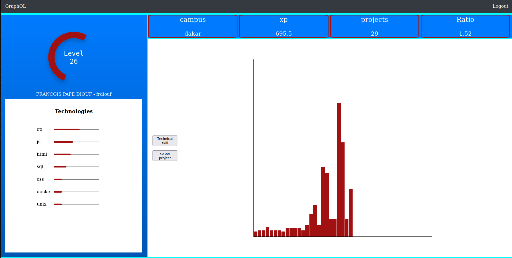

##GraphQL


# Overview 


This project is a sophisticated web application designed to empower users in crafting personalized profile pages through seamless interactions with a GraphQL endpoint. Leveraging cutting-edge technologies, users can curate their profiles with comprehensive user information and dynamic statistics, elegantly visualized using SVG graphs. The application's frontend is meticulously crafted with vanilla JavaScript and Web Components to ensure a fluid and intuitive user experience.

## Key Features

- **Authentication System:** The application boasts a robust login mechanism allowing users to securely access their accounts using either their username or email along with a password. It seamlessly handles invalid credentials, providing clear error feedback. Moreover, users can conveniently log out from their accounts with ease.

- **Profile Customization:** Users can effortlessly tailor their profile pages, showcasing vital user data fetched from the GraphQL endpoint. The profile showcases:
  - Essential user identification details.
  - Accumulated XP points reflecting user progress.
  - Grade insights providing a snapshot of academic achievements.
  - Audit history, offering transparency and accountability.

- **Dynamic Statistics:** Elevating user engagement, the application features a dynamic statistics section enriched with visually compelling SVG graphs. These graphs encapsulate various dimensions of the user's educational journey and accomplishments, enhancing the profile's depth and visual appeal.

## Installation Instructions

1. Clone the repository using one of the following commands:

   ```bash
   git clone https://learn.zone01dakar.sn/git/frdiouf/graphql.git 
   # For Zone01 students 

   git clone https://github.com/dioufra/graphql
   # For GitHub users
   ```
## hosting link
[graphql](https://subtle-khapse-76a5fe.netlify.app)

## Authors
**[frdiouf](https://github.com/dioufra?tab=repositories)**<br>
